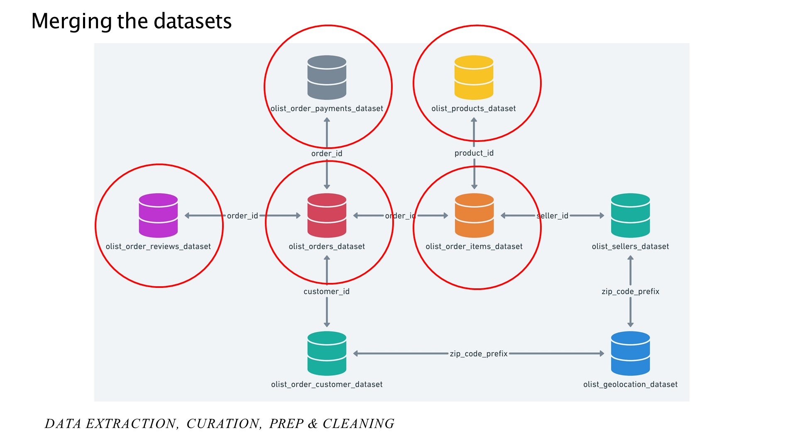
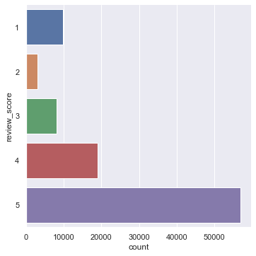
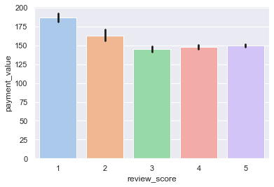
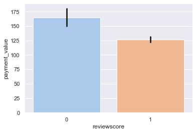
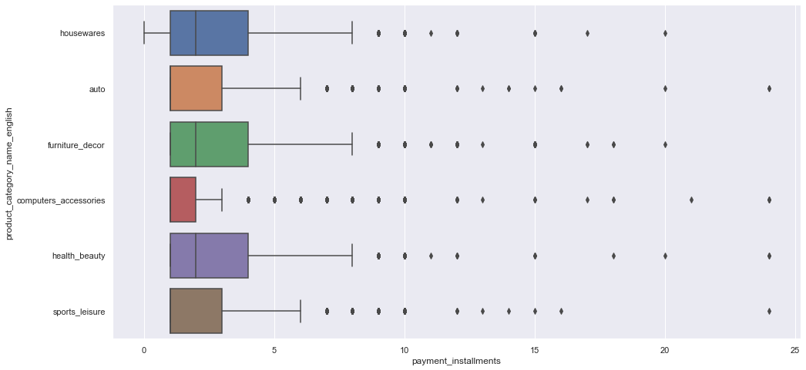
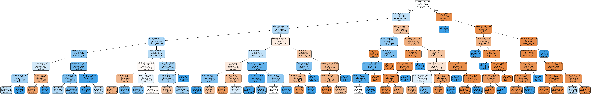
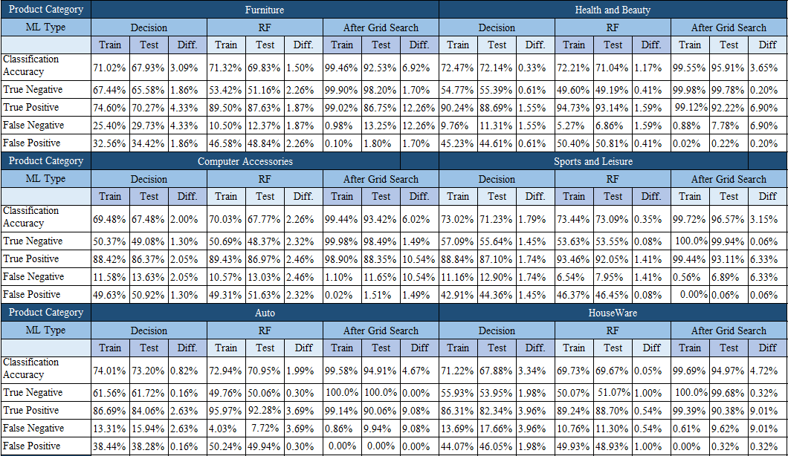

[](https://jupyter.org/try)


---

# DSAI Project: Brazillian Olist E-commerce Database
Hello! We are [Sankar Samiksha](https://github.com/S-Samiksha), [Nusrath Fathima](https://github.com/fath3725) and [Gideon](https://github.com/gmanik30) from Nanyang Technological University. We were tasked to do a project in Data Science. We chose the Brazillian Olist E-commerce Database. 
| Work Done | Files to look at |
| --- | --- |
| Exploratory Data Analysis |(In order) Review Status, Delivery Time, Product Type |
| Machine Learning | Parts 7a, 7b, 8 |

#### About E-Commerce
One of the booming industries in the 21st Century is the E-commerce industry. With many people living a fast-paced life, it is much easier to purchase the items needed with a simple click of a button. Given this rapidly growing industry, sellers have started selling products on online platforms such as Shopee, Lazada, and in Brazil, Olist. 

While sellers are trying to increase their profits as much as they can, much of this profit depends on how much people buy from these sellers. So how are sellers going to attract customers? If they do attract customers, how are they going to ensure a *continuous long-term attraction* of these customers? The answer is customer satisfaction. Many companies and online sellers are increasingly focusing on consumer experience. The more a consumer is contented, the more likely they are going to come back to the seller and the online platform. Additionally, satisfied customers leave positive review scores that attract other customers to the sellers.

Profitero wrote an article stating that review scores are a great reflection of customer satisfaction. As such, we decided to focus on customer satisfaction in the Olist Online Platform in Brazil. Review Score was chosen as our response variable. Through exploratory data analysis, we narrowed down to 5 predictors: actual delivery time, the difference between actual and estimated wait time, freight value, payment value and payment instalment. 


#### The Research Question:
How different variables such as **actual delivery time**, **the difference between actual and estimated wait time**, **freight value**, **payment value**, **payment installment** affect the **review score** in each of the different **product type categories**, `Houseware`, `auto`, `furniture decor`, `computer accessories`, `health beauty`, `sports leisure`? 


#### About the Database
Kaggle provided many datasets among which only a selected few were merged and cleaned. The image below shows the datasets that were merged for this project:




Taken from: https://www.kaggle.com/olistbr/brazilian-ecommerce?select=olist_products_dataset.csv 

Editted using: powerpoint

The above data sets provided the necessary data on the actual delivery time, the difference between actual and estimated wait time, freight value, payment value and payment instalment. Freight value, payment value and payment instalment were primary data provided by Kaggle. 

Actual wait time and the difference between actual and estimated wait time had to be procured from the timestamp Olist provided in its datasets.


#### Packages To Install
 1. Anaconda
 2. Python
 3. Jupyter Notebook (Anaconda)
 4. Python Graphviz (Anaconda)
 5. Github Desktop for collaboration (Optional)

#### The steps taken before machine learning was carried out
 1. Merging Datasets
 2. Filtering reviews based on order status, order status has to be set to delivered
 3. Reclassifying review score into class 0 and class 1
 4. Splitting the dataset into 6 product categories
 5. Removing duplicates and null values
 6. Balancing review score


## Exploratory Data Analysis (EDA)
In the GitHub repository, there are 5 parts to EDA:
 1. Part 1_Review Status
 2. Part 2_Delivery Time
 3. Part 3_Product Type
 4. Part 4_Payment Mode 
 5. Part 5_Multi Variate Analysis

Each of these parts explains the CSVs provided by the Kaggle Website. Additionally, it helps to sieve out variables that affect review score so that they can be later used for multivariate analysis and thereafter machine learning.

#### Cleaning and Reorganizing Review Score
The review score is a categorical data type with a class imbalance. 



Hence, the classes had to be reorganised into two classes. This was to reduce the amount of up-scaling required. Upscaling of the class with the fewer count was needed to balance the classes. 

Review scores 1 and 2 were classified as class 0 and review scores 3,4 and 5 were classified as class 1. The reason for all predictors is the same. Below shows the code used to balance the classes:

```python

    def balancing(dataframe):
        # Class count
        review_class_1, review_class_0 = dataframe.reviewscore.value_counts()

        # Divide by class
        df_review_0 = dataframe[dataframe['reviewscore'] == 0]
        df_review_1 = dataframe[dataframe['reviewscore'] == 1]

        df_review_0_over = df_review_0.sample(review_class_1, replace = True)
        dataframe = pd.concat([df_review_1, df_review_0_over], axis = 0)
        return dataframe

```


To illustrate, let’s take the example of payment value. There was a difference between review score 1 and 2. However, review scores 3,4 and 5 have very similar means and the error bars intercept visually. This suggests that the review scores of 3, 4 and 5 are not that different. 



After reclassification, we see that there is a large difference between class 0 and class 1. 



Hence, reclassification into class 0 and class 1 was done. The same was done to the other predictor variables. 

#### Classification of Data into the different product types
Classification of the data into the different product types was essential since there are inherent differences between the different product types. To give an example, take payment instalments in the different product category types, the mean, the standard deviation and the range are all very different. 



Hence, splitting the data into the different product types would lead to a more accurate machine learning outcome. 

#### Narrowing down to top ten product category types
Category types that were consistently in the top ten from 2016 to 2018 were selected. This is because such products were consistently in high demand. Such products may provide sellers information into which products sell most frequently in the long run. These product category types are: houseware, auto, furniture decor, computer accessories, health beauty, sports leisure?


## Machine Learning 
#### Machine Learning: Decision Tree
A decision tree is a basic machine learning tool. It uses the different numerical predictors to predict whether the review score is of class 0 or class 1. The machine learning outcome changes every time the ipynb is run. 



At each leaf node, a predictor is used. Above a certain value of the predictor variable, the review score is classified into class 1 and below that value, it is classified as class 0. The decision tree has a max depth of 6. Here is the code for the decision tree:

```python
    #https://scikit-learn.org/stable/modules/tree.html
    def train_and_predict(dataframe):
        # Import essential models and functions from sklearn
        from sklearn.tree import DecisionTreeClassifier
        from sklearn.model_selection import train_test_split
        from sklearn.metrics import confusion_matrix

        # Extract Response and Predictors
        y = pd.DataFrame(dataframe['reviewscore'])
        X = pd.DataFrame(dataframe[["payment_installments", "payment_value", "freight_value", "actual_wait_time", "actualxestimated"]]) 

        # Split the Dataset into Train and Test
        X_train, X_test, y_train, y_test = train_test_split(X, y, test_size = 0.25)

        # Decision Tree using Train Data
        dectree = DecisionTreeClassifier(max_depth = 7)  # create the decision tree object
        dectree.fit(X_train, y_train)                    # train the decision tree model

        # Predict Response corresponding to Predictors
        y_train_pred = dectree.predict(X_train)
        y_test_pred = dectree.predict(X_test)

        from sklearn.tree import export_graphviz
        treedot = export_graphviz(dectree, feature_names = X_train.columns, out_file = None, filled = True, rounded = True, special_characters = True,class_names= ["0", "1", "2", "3", "4", "5"])
        import graphviz
        from IPython.display import display
        display(graphviz.Source(treedot))

        # Check the Goodness of Fit (on Train Data)
        print("Goodness of Fit of Model: Train Dataset")
        print("Classification Accuracy : ", dectree.score(X_train, y_train))
        confusion_matrix_train = confusion_matrix(y_train, y_train_pred)
        TN = confusion_matrix_train[0,0]
        TP = confusion_matrix_train[1,1]
        FP = confusion_matrix_train[0,1]
        FN = confusion_matrix_train[1,0]
        print("True Negative Rate      : ", TN/(TN+FP))
        print("True Positive Rate      : ", TP/(TP+FN))
        print("False Negative Rate     : ", FN/(FN+TP))
        print("False Positive Rate     : ", FP/(TN+FP))
        print()

        # Check the Goodness of Fit (on Test Data)
        print("Goodness of Fit of Model: Test Dataset")
        print("Classification Accuracy : ", dectree.score(X_test, y_test))
        confusion_matrix_test = confusion_matrix(y_test, y_test_pred)
        TN = confusion_matrix_test[0,0]
        TP = confusion_matrix_test[1,1]
        FP = confusion_matrix_test[0,1]
        FN = confusion_matrix_test[1,0]
        print("True Negative Rate      : ", TN/(TN+FP))
        print("True Positive Rate      : ", TP/(TP+FN))
        print("False Negative Rate     : ",FN/(FN+TP))
        print("False Positive Rate     : ", FP/(TN+FP))

        # Plot the Confusion Matrix for Train and Test
        f, axes = plt.subplots(1, 2, figsize=(12, 4))
        sb.heatmap(confusion_matrix(y_train, y_train_pred),
                annot = True, fmt=".0f", annot_kws={"size": 18}, ax = axes[0], cmap = "Greens")
        sb.heatmap(confusion_matrix(y_test, y_test_pred), 
                annot = True, fmt=".0f", annot_kws={"size": 18}, ax = axes[1], cmap="Greens")

```


This decision tree method did not provide a very high classification accuracy (65% to 75%), true positive (60% to 85%) and true negative (50% to 60%). There was a large distribution of these values across product types too. Every time the notebook is run, the train and test classification accuracy would differ from a range of 1% to 10%. Additionally, false positive was above 40% for most product types across multiple runs of the ipynb. This shows that the machine learning tool was not the best. 

#### Machine Learning: Random Forest
Another option was to run the random forest algorithm. A random forest uses a 'forest', a multitude of decisions trees that help to classify the data points into the different review scores. The reason why random forest works so well is that "A large number of relatively uncorrelated models (trees) operating as a committee will outperform any of the individual constituent models." (sklearn). Here is the code for the random forest:

```python
    def train_and_predict(dataframe):
        # Import essential models and functions from sklearn
        from sklearn.tree import DecisionTreeClassifier
        from sklearn.model_selection import train_test_split
        from sklearn.metrics import confusion_matrix

        # Extract Response and Predictors
        y = pd.DataFrame(dataframe['reviewscore'])
        X = pd.DataFrame(dataframe[["payment_installments", "payment_value", "freight_value", "actual_wait_time", "actualxestimated"]]) 

        # Split the Dataset into Train and Test
        X_train, X_test, y_train, y_test = train_test_split(X, y, test_size = 0.25)

        # Import RandomForestClassifier model from Scikit-Learn
        from sklearn.ensemble import RandomForestClassifier

        # Create the Random Forest object
        rforest = RandomForestClassifier(n_estimators = 1000,  # n_estimators denote number of trees
                                        max_depth = 10)       # set the maximum depth of each tree

        # Fit Random Forest on Train Data
        rforest.fit(X_train, y_train.reviewscore.ravel())

        # Predict the Response corresponding to Predictors
        y_train_pred = rforest.predict(X_train)
        y_test_pred = rforest.predict(X_test)
        
        # Check the Goodness of Fit (on Train Data)
        print("Goodness of Fit of Model: Train Dataset")
        print("Classification Accuracy : ", rforest.score(X_train, y_train))
        confusion_matrix_train = confusion_matrix(y_train, y_train_pred)
        TN = confusion_matrix_train[0,0]
        TP = confusion_matrix_train[1,1]
        FP = confusion_matrix_train[0,1]
        FN = confusion_matrix_train[1,0]
        print("True Negative Rate      : ", TN/(TN+FP))
        print("True Positive Rate      : ", TP/(TP+FN))
        print("False Negative Rate     : ", FN/(FN+TP))
        print("False Positive Rate     : ", FP/(TN+FP))
        print()

        # Check the Goodness of Fit (on Test Data)
        print("Goodness of Fit of Model: Test Dataset")
        print("Classification Accuracy : ", rforest.score(X_test, y_test))
        confusion_matrix_test = confusion_matrix(y_test, y_test_pred)
        TN = confusion_matrix_test[0,0]
        TP = confusion_matrix_test[1,1]
        FP = confusion_matrix_test[0,1]
        FN = confusion_matrix_test[1,0]
        print("True Negative Rate      : ", TN/(TN+FP))
        print("True Positive Rate      : ", TP/(TP+FN))
        print("False Negative Rate     : ",FN/(FN+TP))
        print("False Positive Rate     : ", FP/(TN+FP))

        # Plot the Confusion Matrix for Train and Test
        f, axes = plt.subplots(1, 2, figsize=(12, 4))
        sb.heatmap(confusion_matrix(y_train, y_train_pred),
                annot = True, fmt=".0f", annot_kws={"size": 18}, ax = axes[0])
        sb.heatmap(confusion_matrix(y_test, y_test_pred), 
                annot = True, fmt=".0f", annot_kws={"size": 18}, ax = axes[1])
```

There is a low correlation between the trees and the trees help to cover each other’s errors to enable the most accurate classification. Hence, we see that the random forest does enable better classification in part 7. The max_depth was set to 6 the same as when the decision tree was run. False positive was still in the same range as the decision tree. 

False positives are generally bad given our research question. This is because sellers want to adjust their actual delivery time, the difference between actual and estimated wait time, freight value, payment value, payment instalment such that they obtain the best review score 1 which was translated to a 3 to 5 review score. If they adjust these factors and get a false positive, then they may predict a high review score but end up getting a low one.

The random forest also gives different outcomes every time the ipynb is run. However, the classification accuracy, true positive, true negative, false positive, false negative as well as the deviation between train and test data change very little across the different runs of the ipynb. The difference from every run is less than 5%. This makes the random forest more reliable than a decision tree given the same set of data given. 

#### Machine Learning: Cross-Validated Grid Search

However, an additional step must be done to reduce the false positive. Tuning of hyperparameters must be done to achieve the highest possible classification accuracy, true positive and true negative and lowest possible false positive and false negative. Hyperparameters are used to make the random forest. There are many hyperparameters but for the scope of this project adept and n_estimators were chosen. max_depth is the maximum depth each decision tree goes in the 'forest' of trees. n_estimators is the number of trees in the forest.

To find the best hyperparameters a Grid Search is done.

Grid Search will then run a range for the hyperparameters. The definition provided by the official Sci-Kit learn website is "The parameters of the estimator used to apply these methods are optimized by cross-validated grid-search over a parameter grid." Cross-validation is defined as "Cross-validation is a statistical method used to estimate the performance (or accuracy) of machine learning models." 

The Best_Score is the average of the cross-validated score of the best hyperparameters. Since cv = 5, the train and test split will occur five times for each hyperparameter. The best score is calculated for each trial and each combination of hyperparameters. The best score will return the average of the best hyperparameter combination in those 5 tries. 

This function will return the best hyperparameters max_depth and n_estimators. The max_depth was run from a range of 2 to 11, using the NumPy range. The n_estimators was run from 100 to 1001 at a step of 100. For all product types, the best max_depth was 10. Here is the code for the Grid Search:

```python
    def best_hyperparameter(dataframe):
        # Import essential models and functions from sklearn
        from sklearn.tree import DecisionTreeClassifier
        from sklearn.model_selection import train_test_split
        from sklearn.metrics import confusion_matrix
        # Import RandomForestClassifier model from Scikit-Learn
        from sklearn.ensemble import RandomForestClassifier

        # Extract Response and Predictors
        y = pd.DataFrame(dataframe['reviewscore'])
        X = pd.DataFrame(dataframe[["payment_installments", "payment_value", "freight_value", "actual_wait_time", "actualxestimated"]]) 

        # Split the Dataset into Train and Test
        X_train, X_test, y_train, y_test = train_test_split(X, y, test_size = 0.25)
        # Import GridSearch for hyperparameter tuning using Cross-Validation (CV)
        from sklearn.model_selection import GridSearchCV

        # Define the Hyper-parameter Grid to search on, in case of Random Forest
        param_grid = {'n_estimators': np.arange(100,1001,100),   # number of trees 100, 200, ..., 1000
                    'max_depth': np.arange(9, 14)}             # depth of trees 2, 3, 4, 5, ..., 10

        # Create the Hyper-parameter Grid
        hpGrid = GridSearchCV(RandomForestClassifier(),   # the model family
                            param_grid,                 # the search grid
                            cv = 5,                     # 5-fold cross-validation
                            scoring = 'accuracy')       # score to evaluate

        # Train the models using Cross-Validation
        hpGrid.fit(X_train, y_train.reviewscore.ravel())
        
        # Fetch the best Model or the best set of Hyper-parameters
        print(hpGrid.best_estimator_)

        # Print the score (accuracy) of the best Model after CV
        print(np.abs(hpGrid.best_score_))

```


After tuning the hyperparameters, classification accuracy, true positive and true negative went above 90% and false positive went below 2% for most product types. Train and test data were similar although had a discrepancy of about 5% to 11%. 

Next, a range of 9 to 14 using the NumPy range was done for max depth. The n_estimators was run from 100 to 1001 at a step of 100. The classification accuracy increased to above 95% for most product types. The train and test data had a discrepancy below 10% this time around. 

By increasing max_depth and varying its n_estimators, the machine learning outcome is much better than what we had originally in the decision tree. Although the outcome still has a significant difference between train and test, it is much smaller than before and does not change every time the ipynb is run, increasing reliability. 

Further increasing max_depth and n_estimators can allow for an even better classification accuracy in test data as well. 
To give a summary of the data and show the differences, look at the below table:

The below table only shows the data for max_depth 10.



## Conclusion
In conclusion, an improvement in overall statistics from the decision tree to the random forest (after Grid Search) is seen. Further improvements can be made by increasing the max_depth. 

Our team has learnt much through this project. We have learnt how to use a random forest, tune hyperparameters and clean data such that it results in a better machine learning outcome.  

We also learnt that sellers should liaise with a delivery team that can deliver faster to obtain lower actual times and actual minus estimated time to increase their review score. Similarly, to attain lower freight value, sellers can order in bulk or find companies that allow lower freight value. 

To achieve lower payment value, sellers should Create deals with credit card companies or banks to enable the lowest payment value. To achieve lower payment instalments sellers can create better and a more variety of payment instalment plans. 

Using our Machine Learning Outcome, sellers will be able to predict their review scores depending on how their variables are changed. This will provide useful insights specific to their business and allow them to modify the variables such that they get higher review scores, and thus garner more business. 


## Acknowledgements:
We want to thank our professor, Prof Sourav Sen Gupta and our lab teaching assistant Prof Kwok Hong Jing for their continuous support and help throughout the project.

# Reference 
Olist, “Brazilian E-Commerce Public Dataset by Olist,” Kaggle, 29-Nov-2018. [Online]. Available: https://www.kaggle.com/olistbr/brazilian-ecommerce?select=olist_orders_dataset.csv. [Accessed: 23-Apr-2021].
L. Breiman and A. Cutler, “Random Forests Leo Breiman and Adele Cutler,” Random forests - classification description. [Online]. Available: https://www.stat.berkeley.edu/~breiman/RandomForests/cc_home.htm. [Accessed: 23-Apr-2021].
K. Anderson, D. Reifenberger, and T. O' Neil, “Assessing the Impact of Ratings and Reviews on eCommerce Performance,” https://www.profitero.com/. [Online]. Available: http://insights.profitero.com/rs/476-BCC-343/images/Assessing%20the%20Impact%20of%20Ratings%20and%20Reviews%20on%20eCommerce%20Performance.pdf. [Accessed: 23-Apr-2021].
“eCommerce is Set to Increase 39 Percent by 2022 in Brazil, Reaching Nearly R$150bn - Press Releases: FIS,” FIS Global. [Online]. Available: https://www.fisglobal.com/en/about-us/media-room/press-release/2018/ecommerce-is-set-to-increase-39-percent-by-2022-in-brazil-reaching-nearly-r150bn. [Accessed: 23-Apr-2021].
B. L. F. @biancamvickers, “Brazilian E-commerce Market 2016 Highlights,” PagBrasil, 17-Jul-2019. [Online]. Available: https://www.pagbrasil.com/insights/brazilian-e-commerce-market-2016-highlights/. [Accessed: 23-Apr-2021].
H. M. -, By, -, Hussain MujtabaHussain is a computer science engineer who specializes in the field of Machine Learning.He is a freelance programmer and fancies trekking, H. Mujtaba, Hussain is a computer science engineer who specializes in the field of Machine Learning.He is a freelance programmer and fancies trekking, and P. enter your name here, “What is Cross Validation in Machine learning? Types of Cross Validation,” GreatLearning Blog: Free Resources what Matters to shape your Career!, 24-Sep-2020. [Online]. Available: https://www.mygreatlearning.com/blog/cross-validation/. [Accessed: 21-Apr-2021].
abuabu 54777 silver badges1616 bronze badges, Mischa LisovyiMischa Lisovyi 2, and Vivek KumarVivek Kumar 28.8k66 gold badges7575 silver badges109109 bronze badges, “Interpreting sklearns' GridSearchCV best score,” Stack Overflow, 01-Feb-1967. [Online]. Available: https://stackoverflow.com/questions/50232599/interpreting-sklearns-gridsearchcv-best-score. [Accessed: 21-Apr-2021].
R. Joseph, “Grid Search for model tuning,” Medium, 29-Dec-2018. [Online]. Available: https://towardsdatascience.com/grid-search-for-model-tuning-3319b259367e. [Accessed: 21-Apr-2021].
Shahul ES Freelance Data Scientist | Kaggle Master Data science professional with a strong end to end data science/machine learning and deep learning (NLP) skills. Experienced working in a Data Science/ML Engineer role in multiple startups. K, S. ES, Freelance Data Scientist | Kaggle Master Data science professional with a strong end to end data science/machine learning and deep learning (NLP) skills. Experienced working in a Data Science/ML Engineer role in multiple startups. Kaggle Kernels Master ra, and F. me on, “Hyperparameter Tuning in Python: a Complete Guide 2021,” neptune.ai, 19-Mar-2021. [Online]. Available: https://neptune.ai/blog/hyperparameter-tuning-in-python-a-complete-guide-2020#:~:text=Hyperparameter%20tuning%20is%20the%20process,maximum%20performance%20out%20of%20models. [Accessed: 21-Apr-2021].
J. Brownlee, “Hyperparameter Optimization With Random Search and Grid Search,” Machine Learning Mastery, 18-Sep-2020. [Online]. Available: https://machinelearningmastery.com/hyperparameter-optimization-with-random-search-and-grid-search/. [Accessed: 21-Apr-2021].
“sklearn.model_selection.GridSearchCV¶,” scikit. [Online]. Available: https://scikit-learn.org/stable/modules/generated/sklearn.model_selection.GridSearchCV.html. [Accessed: 21-Apr-2021].
M. Sharma, “Grid Search for Hyperparameter Tuning,” Medium, 21-Mar-2020. [Online]. Available: https://towardsdatascience.com/grid-search-for-hyperparameter-tuning-9f63945e8fec. [Accessed: 21-Apr-2021].
R. Meinert, “Optimizing Hyperparameters in Random Forest Classification,” Medium, 07-Jun-2019. [Online]. Available: https://towardsdatascience.com/optimizing-hyperparameters-in-random-forest-classification-ec7741f9d3f6. [Accessed: 21-Apr-2021].
“sklearn.ensemble.randomforestclassifier¶.” [Online]. Available: https://scikit-learn.org/stable/modules/generated/sklearn.ensemble.RandomForestClassifier.html. [Accessed: 21-Apr-2021]. 


Thank you for dropping by.
